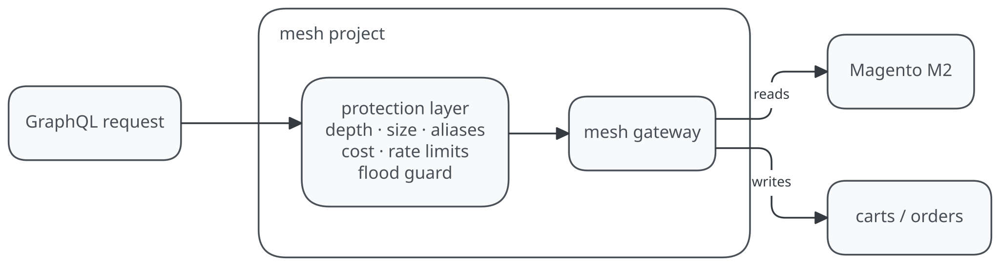

# Mesh: GraphQL gateway with API-level protection

GraphQL Mesh v1 gateway (Hive Gateway runtime) with a protection layer that
covers what Cloudflare API Shield's GraphQL protection covers, natively in The
Guild stack, and adds what it cannot do.

Purpose: automatic detection and blocking of abusive mutation-level traffic
through payload analysis. This is the card-testing scenario: bursts of
low-value mutations from rotating IPs, which IP-based edge rules miss.

<picture>
  <source media="(prefers-color-scheme: dark)" srcset="../../docs/mesh-protection-dark.svg">
  
</picture>

## Protection inventory

All limits live in `lib/security.mjs` and are env-tunable (no code changes to
tune).

| Control | Implementation | Cloudflare equivalent | Default |
| --- | --- | --- | --- |
| Query depth limit | GraphQL Armor `maxDepth` (the same plugin Hive Gateway's own maxDepth uses) | Depth rules on GraphQL traffic | 10 (`MESH_MAX_DEPTH`) |
| Document size limit | GraphQL Armor `maxTokens` (token count at parse time, rejects before validation) | Size limits on GraphQL traffic | 1000 (`MESH_MAX_TOKENS`) |
| Weighted complexity ceiling | GraphQL Armor `costLimit` | Blocking of suspiciously large or complex queries | 5000 (`MESH_MAX_COST`) |
| Mutation flood guard + identity lockout | Custom Envelop plugin (`useOperationGuard`): counts mutations per client IP over a sliding window; over the limit it blocks the operation and locks the identity out for the window, reads included | Mutation-level abuse detection (body-based) | 40 / 60s (`MESH_MUTATION_FLOOD_MAX`, `MESH_MUTATION_FLOOD_WINDOW_MS`) |
| Per-field rate limits | Hive Gateway `useRateLimiting`: quotas on individual mutation fields keyed by `context.clientIp` | Not offered (Cloudflare keys on IP and path, not GraphQL fields) | `createCart` 5/min, `placeOrder` 5/min, cart-line mutations 30/min |
| Alias abuse limit | GraphQL Armor `maxAliases` | Not offered | 15 (`MESH_MAX_ALIASES`) |
| Schema-leak masking | GraphQL Armor `blockFieldSuggestions` ("Did you mean" suggestions hidden) | Not offered | on |
| CSRF prevention | Gateway built-in (`csrfPrevention`): rejects form-style content types | none | on |
| Error masking | Gateway built-in (`maskedErrors`): resolver internals never leave the function | none | on |
| Weighted cost accounting | Gateway built-in `demandControl` (mutations carry a base cost of 10; add `@cost`/`@listSize` directives to model expensive fields) | Partial (static depth and size only) | maxCost 5000, listSize 100 |
| Introspection control | Gateway built-in (`disableIntrospection`) | none | on, disable with `MESH_DISABLE_INTROSPECTION=true` |

### What this layer does that Cloudflare's GraphQL protection cannot

Cloudflare's feature only parses POST bodies under 20 KB with
`application/json` or `application/graphql` content types, on paths ending in
`/graphql`, and does not support fragments or multiple operations. Real GraphQL
clients (Apollo, the Guild toolkit) use fragments heavily, so a large share of
legitimate mesh traffic would be invisible to it. This layer inspects the
parsed operation AST inside the gateway: fragments, multiple operations, any
path, any body size within function limits. Field-level quotas are also more
precise than Cloudflare's IP and path rules. "5 `placeOrder` per minute per
client" is not expressible in API Shield.

### Layered with Vercel Firewall

- **Vercel Firewall (edge):** JA4-fingerprint and IP rate limits, bot
  protection and challenge mode stop volumetric or distributed attacks before
  they consume compute. The gateway sees one invocation per request either
  way; the edge is the cheap place to absorb volume, and JA4 is only visible
  there.
- **Gateway (this layer):** GraphQL-aware controls. The edge cannot parse
  GraphQL semantics.

### What the protection layer costs

API Shield is an Enterprise-only paid add-on, priced by quote and metered per
request. Petbarn's Cloudflare engagement list (Aug 2026) puts roughly the same
1.4B requests/month behind WAF, Advanced Rate Limiting, API Shield and CDN, plus
~600M through Bot Management: several per-request line items stacked on one
volume. GraphQL protection is one SKU on that stack.

Here, protection is code in a gateway that already runs and is already billed.
The Armor plugins make one pass over the operation AST the gateway parses
anyway, the flood guard is a Map increment, and field quotas hit a cache.
Estimated overhead is 1.5–5 ms of extra Active CPU per request (an
architectural estimate, not a benchmark). Measured api-mesh production baseline
(Sep 2026, Vercel internal usage data): ~6.4M invocations/day, ~190M/month,
2 GB instances.

At Sydney rates ($0.180/vCPU-hr, $0.0149/GB-hr; the invocation count does not
change):

| Assumed overhead            | Extra Active CPU    | Cost        |
| --------------------------- | ------------------- | ----------- |
| +1.5 ms/request             | ~80 vCPU-hrs/month  | ~$14/month  |
| +5 ms/request (pessimistic) | ~267 vCPU-hrs/month | ~$48/month  |

Optional shared Redis for the rate-limit counters adds low single digits to
~$50/month at this scale. The commercial comparison: the API Shield GraphQL
protection Petbarn would actually use is a per-request-metered Enterprise
add-on on 1.4B requests, while this layer delivers that protection class plus
what Cloudflare's parser cannot see (fragments, multiple operations, per-field
quotas) for on the order of $10–50/month of compute, absorbed into existing
Enterprise terms.

## Data sources

- **Live catalog, the staging M2.** `lib/magento.mjs` reads product data from
  `mcstaging.petbarn.com.au/graphql` (Adobe Commerce Cloud). Queries only: the
  POC never writes to the staging environment. Auth uses the staging basic-auth
  credential via `MESH_MAGENTO_AUTH` (base64, the same credential the Fastly
  VCL injects for `/media`; treat it as sensitive and rotate it at cutover).
  Omit the variable and everything runs on the local demo catalog.
- **Local fallback.** `lib/data.mjs` fills gaps (fish products, staging
  outages) and backs all cart and order mutations, so the abuse demo is
  deterministic and writes stay off the staging environment.
- **Countries subgraph.** Kept for the cross-source `storeLocations` stitch and
  a naturally recursive schema for depth-attack tests.
- Production shape note: the production api-mesh fronts M2 GraphQL as a
  composed Mesh subgraph. The thin client here avoids Magento type collisions
  in the demo schema; composing the M2 subgraph is the cutover refactor.

## Operations notes

- **Rate-limit state:** in-memory per gateway instance by default. Fine for a
  single-instance POC. Set `REDIS_URL` for a shared store so quotas hold
  across instances.
- **Observability:** one structured JSON log line per request and per block
  (`graphql.protection_config` on cold start, `graphql.operation`,
  `graphql.flood_blocked`), visible in Vercel logs and any log drain. Blocked
  requests surface as GraphQL errors: flood-guard blocks carry the
  `GRAPHQL_MUTATION_FLOOD_BLOCKED` extension code; field-quota blocks return a
  `Rate limit of "Type.field" exceeded` message. Status codes are 400
  (flood and parse-time blocks) or 200 with errors (resolver-level quotas);
  hard 429s at the network edge remain the Firewall's job.
- **Persisted documents** (only pre-registered operation hashes execute,
  `persistedDocuments` gateway option) are the recommended end state for
  production. Not enabled here: the clients would need their operations
  extracted into a registry first.
- **Limitations:** quotas key on client IP; an authenticated identity is
  stronger where a session exists. Lockout is all-or-nothing per identity for
  the window, so tune `MESH_MUTATION_FLOOD_*` against real traffic. Cost
  weights are structural defaults until `@cost`/`@listSize` directives are
  added to the schema. `maxTokens` blocks at parse time with a generic
  parse-failure message (expected Armor behavior).

## Running

```bash
pnpm dev            # gateway at :4000/api/graphql (GraphiQL playground on GET)
pnpm test:security  # abuse suite against http://localhost:4000 (or pass --base)
pnpm build          # smoke test: composes, boots with protection, resolves
```

Against a deployed instance:

```bash
node scripts/abuse-test.mjs --base https://<mesh-domain>/api/graphql
```

The abuse suite (9 checks) proves: legit traffic passes, deep nesting,
oversized documents and alias abuse are blocked, typo-probing leaks nothing,
field quotas fire on `placeOrder`, the flood guard blocks a 45-mutation burst
and locks the identity out, and it reports whether introspection is exposed.

## Files

- `lib/security.mjs`: all limits, env tuning, the `useOperationGuard` plugin,
  rate-limit store resolution
- `lib/gateway.mjs`: gateway wiring (`gatewaySecurityOptions()` +
  `securityPlugins()`)
- `lib/magento.mjs`: read-only staging M2 catalog client (auth via
  `MESH_MAGENTO_AUTH`)
- `lib/data.mjs`, `lib/generated/`: fallback data and composed supergraph
- `scripts/abuse-test.mjs`: dependency-free abuse suite
