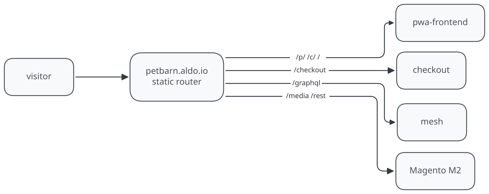

# Router

Static rewrites project.\
No framework, no compute.

### How it works

- `rewrites` run on Vercel's edge router before any compute\
- `firewall.mjs` runs on every deploy and upserts firewall rules.

<picture>
  <source media="(prefers-color-scheme: dark)" srcset="../../docs/routing-dark.svg">
  
</picture>

### Route logic (mirrors Fastly VCL, v1041)

| Requests to | Where they go |
| --- | --- |
| `/graphql`, `/api/graphql` | mesh app |
| `/`, `/p/`, `/c/`, `/catalogsearch`, `/checkout/onepage/success`, `/customer/account/edit`, `/api/*` | storefront (pwa-frontend staging) |
| `/checkout` | 308 redirect to `/checkout/cart` |
| other `/checkout/*` | checkout app |
| `/petai-chat`, `/petai_static`, `/petwatch`, `/consent-centre`, `/shop-repeat-delivery` | each feature's staging backend |
| `/media`, `/static`, `/skin`, `/rest`, `/customer/*` | Magento (`mcstaging.petbarn.com.au`) |
| everything else | storefront (pwa-frontend staging). **The default catch-all stays on the storefront**: unknown traffic never hops to Magento |

### Limits

2048 total routes per deployment\
rewrites, redirects and headers each count as one\
staging config uses 39

### FYI

**(1) rule order matters: first match wins**

- specific paths (graphql, checkout, m2 lane) come before the `/:path*`
  catch-all

**(2) `x-vercel-enable-rewrite-caching: 0` header**

- prevents response caching of proxied APIs at the router level

**(3) proxied apps must not use absolute URLs**

- eg. a link to `/about` is fine, but not
  `https://staging-storefront.vercel.app/about`

**(4) proxied apps must not set `domain` attribute on cookies**

- cookies default to the visitor's current domain, so proxied apps can share
  them

**(5) rewrites can't set request headers**

- the staging pwa-frontend has Vercel Authentication on
  (`all_except_custom_domains`): a `_vercel_jwt` bypass cookie gets through
  (see `scripts/validate-routes.mjs`)
- at cutover the fix is disabling Deployment Protection on backend projects
